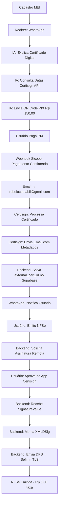
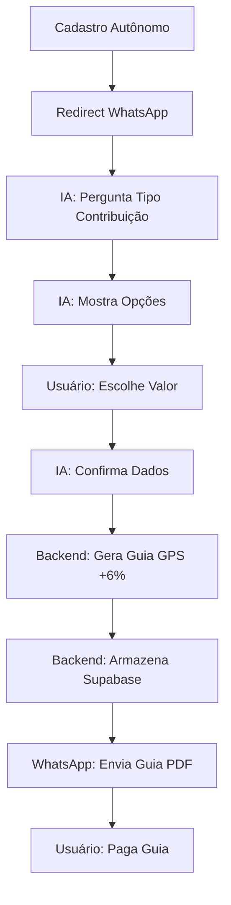

# 🔐 FLUXO COMPLETO - CERTIFICADO DIGITAL ICP-BRASIL + WHATSAPP + IA

**Data:** 01/11/2025  
**Status:** 🎯 Planejamento & Análise

---

## 📋 RESUMO EXECUTIVO

### ✅ O QUE JÁ TEMOS (Pronto para usar)

1. **Integração Sicoob PIX** (100% funcional)
   - ✅ POST `/api/sicoob/pix/cobranca-imediata` - QR Code PIX
   - ✅ GET `/api/sicoob/pix/qrcode/:txid` - Consultar QR Code
   - ✅ Webhook pagamentos (sicoob_notificacoes)
   - ✅ Banco de dados: `sicoob_cobrancas` + `sicoob_notificacoes`

2. **WhatsApp + IA** (83% funcional - modo mock)
   - ✅ WhatsAppService (Twilio mock operacional)
   - ✅ GPT-4o (OpenAI) conectado
   - ✅ Webhook `/webhook/whatsapp` funcional
   - ✅ Fluxo: Receber → IA → Resposta → WhatsApp
   - ✅ Templates de mensagens

3. **Emissão INSS** (100% funcional)
   - ✅ 28/28 testes passando
   - ✅ Geração de guias GPS
   - ✅ Cálculo de valores e competências
   - ✅ Armazenamento Supabase

4. **Emissão NFSe** (94% funcional)
   - ✅ 31/33 testes passando
   - ✅ Assinatura XML (local - precisa migrar para remota)
   - ⚠️ Certificado atualmente armazenado localmente (precisa migrar)

5. **Frontend** (100% operacional)
   - ✅ React + Vite (port 5173)
   - ✅ Cadastro MEI/Autônomo/Parceiro
   - ✅ Dashboards funcionais
   - ✅ Mock authentication

---

## 🎯 FLUXOS A IMPLEMENTAR

### 🏢 **FLUXO MEI - Certificado Digital ICP-Brasil**



**Duração Estimada:** 3-5 dias úteis (certificado) + uso instantâneo (NFSe)

---

### 👤 **FLUXO AUTÔNOMO - Guia INSS**



**Duração Estimada:** Instantâneo (guia gerada em segundos)

---

## 🗄️ ESTRUTURA DE BANCO DE DADOS SUPABASE

### **Tabela: `cert_providers`** (Certificadoras)

```sql
CREATE TABLE cert_providers (
    id UUID PRIMARY KEY DEFAULT gen_random_uuid(),
    nome VARCHAR(255) NOT NULL, -- Ex: "Certisign"
    api_base_url TEXT NOT NULL, -- Ex: "https://api.certisign.com.br"
    api_key_encrypted TEXT, -- Criptografada
    webhook_secret TEXT, -- Para validar callbacks
    ativo BOOLEAN DEFAULT true,
    created_at TIMESTAMPTZ DEFAULT NOW(),
    updated_at TIMESTAMPTZ DEFAULT NOW()
);

-- Índices
CREATE INDEX idx_cert_providers_ativo ON cert_providers(ativo);
```

---

### **Tabela: `cert_enrollments`** (Vínculos Certificado ↔ Usuário)

```sql
CREATE TABLE cert_enrollments (
    id UUID PRIMARY KEY DEFAULT gen_random_uuid(),
    user_id UUID NOT NULL REFERENCES auth.users(id) ON DELETE CASCADE,
    provider_id UUID NOT NULL REFERENCES cert_providers(id),
    
    -- Metadados do Certificado (NUNCA armazenar PFX/chave privada)
    external_cert_id VARCHAR(255) NOT NULL, -- ID na Certisign
    subject TEXT NOT NULL, -- CN=NOME DO MEI:CNPJ
    serial_number VARCHAR(255) NOT NULL,
    thumbprint VARCHAR(255) NOT NULL, -- SHA-256
    
    -- Validade
    valid_from TIMESTAMPTZ NOT NULL,
    valid_until TIMESTAMPTZ NOT NULL,
    
    -- Status
    status VARCHAR(50) DEFAULT 'PENDING', -- PENDING | ACTIVE | EXPIRED | REVOKED
    
    -- Auditoria
    enrolled_at TIMESTAMPTZ DEFAULT NOW(),
    approved_at TIMESTAMPTZ,
    last_used_at TIMESTAMPTZ,
    
    created_at TIMESTAMPTZ DEFAULT NOW(),
    updated_at TIMESTAMPTZ DEFAULT NOW(),
    
    UNIQUE(external_cert_id)
);

-- Índices
CREATE INDEX idx_cert_enrollments_user ON cert_enrollments(user_id);
CREATE INDEX idx_cert_enrollments_status ON cert_enrollments(status);
CREATE INDEX idx_cert_enrollments_validity ON cert_enrollments(valid_until) WHERE status = 'ACTIVE';
```

---

### **Tabela: `sign_requests`** (Solicitações de Assinatura)

```sql
CREATE TABLE sign_requests (
    id UUID PRIMARY KEY DEFAULT gen_random_uuid(),
    enrollment_id UUID NOT NULL REFERENCES cert_enrollments(id) ON DELETE CASCADE,
    user_id UUID NOT NULL REFERENCES auth.users(id) ON DELETE CASCADE,
    
    -- Contexto
    document_type VARCHAR(50) NOT NULL, -- 'DPS' | 'EVENTO_NFSE' | 'CANCELAMENTO'
    document_id UUID, -- ID do documento sendo assinado
    
    -- Hash para assinar
    hash_algorithm VARCHAR(20) DEFAULT 'SHA256', -- SHA256 | SHA512
    hash_value TEXT NOT NULL, -- Hex do hash
    
    -- Resposta da Certisign
    signature_value TEXT, -- DER/PKCS#1 em Base64
    signature_algorithm VARCHAR(50), -- RSA-SHA256
    
    -- Status
    status VARCHAR(50) DEFAULT 'PENDING', -- PENDING | APPROVED | REJECTED | EXPIRED
    
    -- Consentimento
    user_consent_at TIMESTAMPTZ,
    user_ip VARCHAR(45),
    user_agent TEXT,
    
    -- Timestamps
    requested_at TIMESTAMPTZ DEFAULT NOW(),
    completed_at TIMESTAMPTZ,
    expires_at TIMESTAMPTZ DEFAULT NOW() + INTERVAL '5 minutes',
    
    created_at TIMESTAMPTZ DEFAULT NOW(),
    updated_at TIMESTAMPTZ DEFAULT NOW()
);

-- Índices
CREATE INDEX idx_sign_requests_enrollment ON sign_requests(enrollment_id);
CREATE INDEX idx_sign_requests_status ON sign_requests(status);
CREATE INDEX idx_sign_requests_expires ON sign_requests(expires_at) WHERE status = 'PENDING';
```

---

### **Tabela: `sign_audit_logs`** (Auditoria Completa - LGPD)

```sql
CREATE TABLE sign_audit_logs (
    id UUID PRIMARY KEY DEFAULT gen_random_uuid(),
    sign_request_id UUID NOT NULL REFERENCES sign_requests(id) ON DELETE CASCADE,
    user_id UUID NOT NULL REFERENCES auth.users(id) ON DELETE CASCADE,
    enrollment_id UUID NOT NULL REFERENCES cert_enrollments(id),
    
    -- Evento
    event_type VARCHAR(100) NOT NULL, -- 'REQUEST_CREATED' | 'USER_APPROVED' | 'SIGNATURE_RECEIVED'
    event_data JSONB, -- Dados contextuais
    
    -- Rastreabilidade
    ip_address VARCHAR(45),
    user_agent TEXT,
    timestamp TIMESTAMPTZ DEFAULT NOW(),
    
    created_at TIMESTAMPTZ DEFAULT NOW()
);

-- Índices
CREATE INDEX idx_sign_audit_user ON sign_audit_logs(user_id);
CREATE INDEX idx_sign_audit_timestamp ON sign_audit_logs(timestamp);
CREATE INDEX idx_sign_audit_event_type ON sign_audit_logs(event_type);
```

---

### **Tabela: `payment_cert_digital`** (Pagamentos Certificado)

```sql
CREATE TABLE payment_cert_digital (
    id UUID PRIMARY KEY DEFAULT gen_random_uuid(),
    user_id UUID NOT NULL REFERENCES auth.users(id) ON DELETE CASCADE,
    
    -- PIX Sicoob
    txid VARCHAR(255) NOT NULL UNIQUE, -- ID da cobrança PIX
    qr_code TEXT NOT NULL,
    valor DECIMAL(10,2) DEFAULT 150.00,
    
    -- Status
    status VARCHAR(50) DEFAULT 'PENDING', -- PENDING | PAID | EXPIRED | CANCELLED
    paid_at TIMESTAMPTZ,
    
    -- Certificado vinculado
    enrollment_id UUID REFERENCES cert_enrollments(id),
    
    created_at TIMESTAMPTZ DEFAULT NOW(),
    updated_at TIMESTAMPTZ DEFAULT NOW()
);

-- Índices
CREATE INDEX idx_payment_cert_user ON payment_cert_digital(user_id);
CREATE INDEX idx_payment_cert_status ON payment_cert_digital(status);
```

---

## 🔗 INTEGRAÇÕES NECESSÁRIAS

### 1. **API Certisign (Certificadora)**

#### Endpoint: Consultar Datas Disponíveis
```typescript
GET https://api.certisign.com.br/v1/agendamento/datas-disponiveis
Headers:
  Authorization: Bearer {API_KEY}
  Content-Type: application/json

Response:
{
  "datas": [
    { "data": "2025-11-05", "horarios": ["09:00", "14:00", "16:30"] },
    { "data": "2025-11-06", "horarios": ["10:00", "15:00"] }
  ]
}
```

#### Endpoint: Solicitar Criação de Certificado
```typescript
POST https://api.certisign.com.br/v1/certificados/solicitar
Headers:
  Authorization: Bearer {API_KEY}
  Content-Type: application/json

Body:
{
  "tipo": "ICP_BRASIL_A1", // ou A3
  "titular": {
    "nome": "João da Silva",
    "cpf_cnpj": "12345678901234",
    "email": "joao@example.com",
    "telefone": "+5548991117268"
  },
  "solicitante": {
    "nome": "GuiasMEI",
    "email": "rebelocontabil@gmail.com"
  },
  "data_agendamento": "2025-11-05T14:00:00Z",
  "callback_url": "https://api.guiasmei.com.br/webhook/certisign"
}

Response:
{
  "solicitacao_id": "CERT-2025-001234",
  "status": "AGENDADO",
  "external_cert_id": "null", // Será preenchido após emissão
  "data_agendamento": "2025-11-05T14:00:00Z"
}
```

#### Endpoint: Callback Certisign → GuiasMEI
```typescript
POST https://api.guiasmei.com.br/webhook/certisign
Headers:
  X-Certisign-Signature: {HMAC_SHA256}
  Content-Type: application/json

Body:
{
  "solicitacao_id": "CERT-2025-001234",
  "external_cert_id": "CERT-ICP-789456",
  "status": "ATIVO",
  "subject": "CN=JOAO DA SILVA:12345678901234",
  "serial_number": "1A2B3C4D5E6F",
  "thumbprint": "9F86D081884C7D659A2FEAA0C55AD015A3BF4F1B",
  "valid_from": "2025-11-05T00:00:00Z",
  "valid_until": "2026-11-05T23:59:59Z",
  "senha_temporaria": "ABC123XYZ", // Enviada por email separado
  "api_assinatura_url": "https://api.certisign.com.br/v1/assinatura/remota"
}
```

---

### 2. **API Assinatura Remota (Certisign)**

#### Endpoint: Solicitar Assinatura
```typescript
POST https://api.certisign.com.br/v1/assinatura/remota/solicitar
Headers:
  Authorization: Bearer {API_KEY}
  Content-Type: application/json

Body:
{
  "external_cert_id": "CERT-ICP-789456",
  "hash_algorithm": "SHA256",
  "hash_value": "9f86d081884c7d659a2feaa0c55ad015a3bf4f1b2b0b822cd15d6c15b0f00a08",
  "callback_url": "https://api.guiasmei.com.br/webhook/certisign/assinatura",
  "contexto": {
    "documento": "DPS",
    "identificador": "DPS-2025-001"
  }
}

Response:
{
  "sign_request_id": "SIGN-2025-456789",
  "status": "AGUARDANDO_APROVACAO",
  "qr_code_url": "https://app.certisign.com.br/aprovar/SIGN-2025-456789",
  "expires_at": "2025-11-01T15:35:00Z"
}
```

#### Endpoint: Callback Assinatura Aprovada
```typescript
POST https://api.guiasmei.com.br/webhook/certisign/assinatura
Headers:
  X-Certisign-Signature: {HMAC_SHA256}
  Content-Type: application/json

Body:
{
  "sign_request_id": "SIGN-2025-456789",
  "status": "ASSINADO",
  "signature_value": "MIIBIjANBgkqhkiG9w0BAQEFAAOCAQ8AMIIBCgKCAQEA...", // Base64
  "signature_algorithm": "RSA-SHA256",
  "signed_at": "2025-11-01T15:32:45Z",
  "user_device": "iPhone 14 Pro",
  "user_location": "Florianópolis, SC"
}
```

---

### 3. **Email Automático (Certisign ← GuiasMEI)**

#### Template Email: Solicitação Certificado
```
Para: rebelocontabil@gmail.com
Assunto: [GuiasMEI] Nova Solicitação de Certificado Digital - CERT-2025-001234

Olá, Rebelo Contábil!

Um novo cliente solicitou certificado digital ICP-Brasil através da plataforma GuiasMEI.

📋 Dados do Cliente:
- Nome: João da Silva
- CNPJ: 12.345.678/0001-34
- Email: joao@example.com
- WhatsApp: (48) 99111-7268

📅 Agendamento:
- Data: 05/11/2025
- Horário: 14:00

💰 Pagamento:
- Status: CONFIRMADO (PIX R$ 150,00)
- TXID: abc123def456

🔗 Próximos Passos:
1. Entrar em contato com o cliente via WhatsApp
2. Realizar validação presencial/remota
3. Emitir certificado digital ICP-Brasil A1/A3
4. Enviar metadados via API GuiasMEI

---
Plataforma GuiasMEI
https://guiasmei.com.br
```

---

## 🛠️ IMPLEMENTAÇÃO BACKEND

### **Service: CertificateService.ts** (Node.js/TypeScript)

```typescript
// apps/backend/src/services/certificate.service.ts

import axios from 'axios';
import crypto from 'crypto';
import { supabase } from '../config/supabase';

interface CertProvider {
  id: string;
  nome: string;
  api_base_url: string;
  api_key_encrypted: string;
}

interface EnrollmentData {
  userId: string;
  nome: string;
  cpf_cnpj: string;
  email: string;
  telefone: string;
  dataAgendamento: string;
}

export class CertificateService {
  private provider: CertProvider;

  constructor(providerNome: string = 'Certisign') {
    // Buscar provider do banco
    // this.provider = await supabase...
  }

  /**
   * Consultar datas disponíveis para agendamento
   */
  async consultarDatasDisponiveis(): Promise<Array<{ data: string; horarios: string[] }>> {
    const response = await axios.get(
      `${this.provider.api_base_url}/v1/agendamento/datas-disponiveis`,
      {
        headers: {
          'Authorization': `Bearer ${this.decryptApiKey()}`,
          'Content-Type': 'application/json'
        }
      }
    );
    
    return response.data.datas;
  }

  /**
   * Solicitar criação de certificado
   */
  async solicitarCertificado(data: EnrollmentData): Promise<string> {
    const response = await axios.post(
      `${this.provider.api_base_url}/v1/certificados/solicitar`,
      {
        tipo: 'ICP_BRASIL_A1',
        titular: {
          nome: data.nome,
          cpf_cnpj: data.cpf_cnpj,
          email: data.email,
          telefone: data.telefone
        },
        solicitante: {
          nome: 'GuiasMEI',
          email: 'rebelocontabil@gmail.com'
        },
        data_agendamento: data.dataAgendamento,
        callback_url: process.env.BACKEND_URL + '/webhook/certisign'
      },
      {
        headers: {
          'Authorization': `Bearer ${this.decryptApiKey()}`,
          'Content-Type': 'application/json'
        }
      }
    );

    // Enviar email para rebelocontabil@gmail.com
    await this.enviarEmailCertificadora(data, response.data.solicitacao_id);

    return response.data.solicitacao_id;
  }

  /**
   * Processar callback da certificadora (certificado emitido)
   */
  async processarCallbackCertificado(payload: any): Promise<void> {
    // Validar HMAC signature
    this.validarSignature(payload);

    // Salvar enrollment no Supabase
    const { data: enrollment } = await supabase
      .from('cert_enrollments')
      .insert({
        user_id: payload.user_id, // Buscar por solicitacao_id
        provider_id: this.provider.id,
        external_cert_id: payload.external_cert_id,
        subject: payload.subject,
        serial_number: payload.serial_number,
        thumbprint: payload.thumbprint,
        valid_from: payload.valid_from,
        valid_until: payload.valid_until,
        status: 'ACTIVE',
        approved_at: new Date()
      })
      .select()
      .single();

    // Notificar usuário via WhatsApp
    await this.notificarUsuarioCertificadoPronto(enrollment.user_id);
  }

  /**
   * Solicitar assinatura remota
   */
  async solicitarAssinatura(userId: string, hash: string, documentType: string): Promise<string> {
    // Buscar enrollment do usuário
    const { data: enrollment } = await supabase
      .from('cert_enrollments')
      .select('*')
      .eq('user_id', userId)
      .eq('status', 'ACTIVE')
      .single();

    if (!enrollment) {
      throw new Error('Usuário não possui certificado digital ativo');
    }

    // Criar sign_request no banco
    const { data: signRequest } = await supabase
      .from('sign_requests')
      .insert({
        enrollment_id: enrollment.id,
        user_id: userId,
        document_type: documentType,
        hash_algorithm: 'SHA256',
        hash_value: hash,
        status: 'PENDING',
        expires_at: new Date(Date.now() + 5 * 60 * 1000) // 5 minutos
      })
      .select()
      .single();

    // Solicitar à Certisign
    const response = await axios.post(
      `${this.provider.api_base_url}/v1/assinatura/remota/solicitar`,
      {
        external_cert_id: enrollment.external_cert_id,
        hash_algorithm: 'SHA256',
        hash_value: hash,
        callback_url: `${process.env.BACKEND_URL}/webhook/certisign/assinatura`,
        contexto: {
          documento: documentType,
          identificador: signRequest.id
        }
      },
      {
        headers: {
          'Authorization': `Bearer ${this.decryptApiKey()}`,
          'Content-Type': 'application/json'
        }
      }
    );

    // Atualizar sign_request com sign_request_id da Certisign
    await supabase
      .from('sign_requests')
      .update({
        external_sign_id: response.data.sign_request_id,
        qr_code_url: response.data.qr_code_url
      })
      .eq('id', signRequest.id);

    // Notificar usuário via WhatsApp com QR Code
    await this.notificarUsuarioAprovarAssinatura(userId, response.data.qr_code_url);

    return signRequest.id;
  }

  /**
   * Processar callback de assinatura aprovada
   */
  async processarCallbackAssinatura(payload: any): Promise<void> {
    // Validar HMAC signature
    this.validarSignature(payload);

    // Buscar sign_request
    const { data: signRequest } = await supabase
      .from('sign_requests')
      .select('*')
      .eq('external_sign_id', payload.sign_request_id)
      .single();

    // Atualizar com signature_value
    await supabase
      .from('sign_requests')
      .update({
        signature_value: payload.signature_value,
        signature_algorithm: payload.signature_algorithm,
        status: 'APPROVED',
        completed_at: new Date(),
        user_consent_at: payload.signed_at
      })
      .eq('id', signRequest.id);

    // Registrar auditoria
    await supabase
      .from('sign_audit_logs')
      .insert({
        sign_request_id: signRequest.id,
        user_id: signRequest.user_id,
        enrollment_id: signRequest.enrollment_id,
        event_type: 'SIGNATURE_RECEIVED',
        event_data: {
          device: payload.user_device,
          location: payload.user_location,
          signed_at: payload.signed_at
        },
        timestamp: new Date()
      });

    // Continuar fluxo de emissão NFSe...
  }

  private decryptApiKey(): string {
    // Implementar decriptação da API key
    return process.env.CERTISIGN_API_KEY!;
  }

  private validarSignature(payload: any): void {
    // Implementar validação HMAC SHA256
    const signature = payload.headers['X-Certisign-Signature'];
    const computed = crypto
      .createHmac('sha256', this.provider.webhook_secret)
      .update(JSON.stringify(payload.body))
      .digest('hex');
    
    if (signature !== computed) {
      throw new Error('Invalid signature');
    }
  }

  private async enviarEmailCertificadora(data: EnrollmentData, solicitacaoId: string): Promise<void> {
    // Implementar envio de email via SendGrid/Resend
  }

  private async notificarUsuarioCertificadoPronto(userId: string): Promise<void> {
    // Implementar notificação WhatsApp
  }

  private async notificarUsuarioAprovarAssinatura(userId: string, qrCodeUrl: string): Promise<void> {
    // Implementar notificação WhatsApp com QR Code
  }
}
```

---

### **Webhook Routes: Certisign** (Node.js/TypeScript)

```typescript
// apps/backend/src/routes/certisign.routes.ts

import { Router } from 'express';
import { CertificateService } from '../services/certificate.service';

const router = Router();
const certService = new CertificateService();

/**
 * Webhook: Certificado emitido pela Certisign
 */
router.post('/webhook/certisign', async (req, res) => {
  try {
    await certService.processarCallbackCertificado(req);
    res.status(200).json({ status: 'ok' });
  } catch (error) {
    console.error('Erro no webhook Certisign:', error);
    res.status(400).json({ error: error.message });
  }
});

/**
 * Webhook: Assinatura aprovada pelo usuário
 */
router.post('/webhook/certisign/assinatura', async (req, res) => {
  try {
    await certService.processarCallbackAssinatura(req);
    res.status(200).json({ status: 'ok' });
  } catch (error) {
    console.error('Erro no webhook assinatura:', error);
    res.status(400).json({ error: error.message });
  }
});

export default router;
```

---

## 🤖 CONVERSAÇÃO IA - FLUXO MEI

### **Prompts IA (GPT-4o) - WhatsApp**

```javascript
// apps/backend/inss/app/services/ai_prompts.ts

export const PROMPT_MEI_CERTIFICADO_INTRO = `
Você é o assistente virtual da GuiasMEI. Um usuário MEI acabou de se cadastrar.

🎯 Seu objetivo:
1. Dar boas-vindas calorosas
2. Explicar a importância do CERTIFICADO DIGITAL ICP-BRASIL para emitir notas fiscais com segurança
3. Perguntar se o usuário já possui certificado digital
4. Se NÃO possuir, oferecer emissão via parceria com Certisign

💡 Tom: Amigável, claro, educativo.
📱 Formato: Mensagens curtas (max 3 linhas por vez)
🚫 Nunca mencionar detalhes técnicos (XML, DPS, APIs, etc)

Contexto do usuário:
- Nome: {{nome}}
- CNPJ: {{cnpj}}
- Tipo: MEI
`;

export const PROMPT_MEI_CERTIFICADO_CONSULTA_DATAS = `
O usuário não possui certificado digital e quer emitir um.

🎯 Seu objetivo:
1. Informar que o certificado custa R$ 150,00 (pagamento único)
2. Consultar datas disponíveis via função consultar_datas_certisign()
3. Mostrar as 3 próximas datas/horários disponíveis
4. Perguntar qual data/horário prefere

💡 Tom: Empolgado, facilitador.
📱 Formato: Lista de datas clara e objetiva

Exemplo:
"📅 Datas disponíveis para emissão:

1️⃣ 05/11 às 14h
2️⃣ 06/11 às 10h
3️⃣ 07/11 às 16h

Qual prefere? Digite o número (1, 2 ou 3)"
`;

export const PROMPT_MEI_CERTIFICADO_PAGAMENTO = `
O usuário escolheu a data {{data_escolhida}}.

🎯 Seu objetivo:
1. Confirmar a data escolhida
2. Gerar QR Code PIX de R$ 150,00 via função gerar_pix_certificado()
3. Enviar o QR Code PIX para o usuário
4. Explicar próximos passos após pagamento

💡 Tom: Transparente, confiável.
📱 Formato: Mensagem única com QR Code + instruções

Exemplo:
"✅ Agendado para {{data_escolhida}}!

💳 Para confirmar, faça o pagamento de R$ 150,00:

[QR CODE PIX]

📋 Após o pagamento:
1. Você receberá confirmação em até 5 minutos
2. A certificadora entrará em contato via WhatsApp
3. Seu certificado será emitido em 3-5 dias úteis
4. Você poderá emitir notas fiscais pagando apenas R$ 3,00 por nota

Já fez o pagamento?"
`;

export const PROMPT_MEI_CERTIFICADO_POS_PAGAMENTO = `
O pagamento PIX de R$ 150,00 foi confirmado.

🎯 Seu objetivo:
1. Parabenizar o usuário
2. Informar que a certificadora receberá um email automático
3. Avisar o prazo de contato (24-48h)
4. Perguntar se tem dúvidas

💡 Tom: Comemorativo, acolhedor.
📱 Formato: Mensagem única concisa

Exemplo:
"🎉 Pagamento confirmado!

✅ A Rebelo Contábil já recebeu suas informações
📞 Eles entrarão em contato em até 48h
📅 Certificado emitido em 3-5 dias úteis

Você poderá emitir notas fiscais assim que o certificado estiver ativo.

Tem alguma dúvida?"
`;

export const PROMPT_MEI_EMITIR_NFSE = `
O usuário quer emitir uma nota fiscal eletrônica (NFS-e).

🎯 Seu objetivo:
1. Verificar se o usuário tem certificado digital ativo
2. Se SIM: coletar dados da nota (valor, cliente, serviço)
3. Se NÃO: informar que precisa do certificado primeiro

💡 Tom: Profissional, eficiente.
📱 Formato: Perguntas diretas e claras

Exemplo (COM certificado):
"📝 Vou te ajudar a emitir a NFS-e!

Me informe:
1️⃣ Valor da nota (ex: R$ 1.500,00)
2️⃣ Nome do cliente
3️⃣ CNPJ/CPF do cliente
4️⃣ Descrição do serviço"

Exemplo (SEM certificado):
"⚠️ Para emitir notas fiscais, você precisa de um certificado digital ICP-Brasil.

Quer solicitar o seu agora? Custa R$ 150,00 (pagamento único)."
`;
```

---

## 🤖 CONVERSAÇÃO IA - FLUXO AUTÔNOMO

### **Prompts IA (GPT-4o) - WhatsApp**

```javascript
export const PROMPT_AUTONOMO_INTRO = `
Você é o assistente virtual da GuiasMEI. Um usuário AUTÔNOMO acabou de se cadastrar.

🎯 Seu objetivo:
1. Dar boas-vindas calorosas
2. Explicar que você ajuda a gerar GUIAS DE GPS (INSS) automaticamente
3. Perguntar em qual categoria de contribuinte ele se encaixa

💡 Tom: Amigável, claro, educativo.
📱 Formato: Mensagens curtas (max 3 linhas por vez)

Contexto do usuário:
- Nome: {{nome}}
- CPF: {{cpf}}
- Tipo: Autônomo
`;

export const PROMPT_AUTONOMO_TIPO_CONTRIBUINTE = `
Pergunte ao usuário qual tipo de contribuinte ele é.

🎯 Opções:
1️⃣ **Contribuinte Individual** (11% sobre salário mínimo) - R$ 171,66
2️⃣ **Contribuinte Individual** (20% sobre valor escolhido entre R$ 1.518 e R$ 8.157,41)
3️⃣ **Facultativo** (11% sobre salário mínimo) - R$ 171,66
4️⃣ **Facultativo** (20% sobre valor escolhido)
5️⃣ **MEI** (5% sobre salário mínimo) - R$ 75,65

💡 Tom: Didático, paciente.
📱 Formato: Lista numerada clara

Exemplo:
"📊 Escolha seu tipo de contribuição:

1️⃣ Autônomo (11%) - R$ 171,66
2️⃣ Autônomo (20%) - Valor livre
3️⃣ Facultativo (11%) - R$ 171,66
4️⃣ Facultativo (20%) - Valor livre
5️⃣ MEI (5%) - R$ 75,65

Digite o número da opção que se encaixa no seu caso."
`;

export const PROMPT_AUTONOMO_VALOR_CONTRIBUICAO = `
O usuário escolheu a opção {{opcao}} (20% - valor livre).

🎯 Seu objetivo:
1. Perguntar qual valor quer contribuir (entre R$ 1.518,00 e R$ 8.157,41)
2. Explicar que quanto maior o valor, maior a aposentadoria futura

💡 Tom: Consultivo, transparente.
📱 Formato: Pergunta direta + dica

Exemplo:
"💰 Qual valor você quer contribuir?

📌 Mínimo: R$ 1.518,00
📌 Máximo: R$ 8.157,41

💡 Dica: Contribuições maiores = Aposentadoria maior no futuro!

Digite o valor desejado (ex: R$ 2.500,00)"
`;

export const PROMPT_AUTONOMO_GERAR_GUIA = `
O usuário escolheu contribuir com R$ {{valor}}.

🎯 Seu objetivo:
1. Confirmar o valor
2. Calcular o valor da guia ({{valor}} + 6% taxa) = R$ {{valor_final}}
3. Gerar a guia GPS via função gerar_guia_gps()
4. Enviar o PDF da guia no WhatsApp
5. Explicar onde pagar

💡 Tom: Claro, objetivo.
📱 Formato: Confirmação + PDF + instruções

Exemplo:
"✅ Guia GPS gerada com sucesso!

💰 Valor: R$ {{valor_original}}
🏦 Taxa (6%): R$ {{taxa}}
💵 Total a pagar: R$ {{valor_final}}

📄 [PDF DA GUIA GPS] ⬇️

📅 Vencimento: {{vencimento}}

Você pode pagar em qualquer banco, lotérica ou app (Caixa, BB, etc).

Precisa de mais alguma guia?"
`;
```

---

## 📊 DASHBOARD ADMIN - CONFIGURAÇÕES

### **Tela: Configurações de Tarifas** (AdminDashboard.jsx)

```jsx
// apps/web/src/features/dashboards/AdminDashboard.jsx

import React, { useState } from 'react';

export const ConfiguracoesTarifas = () => {
  const [config, setConfig] = useState({
    taxa_nfse: 3.00,              // R$ por nota
    taxa_inss: 6.00,              // % sobre valor da guia
    preco_certificado: 150.00,    // R$ pagamento único
    comissao_parceiro: 20.00,     // % sobre receita do parceiro
  });

  const salvarConfig = async () => {
    const { data, error } = await supabase
      .from('system_config')
      .upsert({
        id: 'tarifas',
        config: config,
        updated_at: new Date()
      });
    
    if (error) {
      alert('Erro ao salvar: ' + error.message);
    } else {
      alert('Configurações salvas com sucesso!');
    }
  };

  return (
    <div style={styles.card}>
      <h2 style={styles.cardTitle}>⚙️ Configurações de Tarifas</h2>
      
      <div style={styles.configGrid}>
        {/* Taxa NFSe */}
        <div style={styles.configItem}>
          <label style={styles.label}>
            📊 Taxa por Nota Fiscal (NFS-e)
          </label>
          <div style={styles.inputGroup}>
            <span style={styles.currency}>R$</span>
            <input
              type="number"
              step="0.01"
              value={config.taxa_nfse}
              onChange={(e) => setConfig({ ...config, taxa_nfse: parseFloat(e.target.value) })}
              style={styles.input}
            />
          </div>
          <small style={styles.helperText}>
            Valor cobrado por cada nota fiscal emitida
          </small>
        </div>

        {/* Taxa INSS */}
        <div style={styles.configItem}>
          <label style={styles.label}>
            📄 Taxa sobre Guia GPS (INSS)
          </label>
          <div style={styles.inputGroup}>
            <input
              type="number"
              step="0.01"
              value={config.taxa_inss}
              onChange={(e) => setConfig({ ...config, taxa_inss: parseFloat(e.target.value) })}
              style={styles.input}
            />
            <span style={styles.currency}>%</span>
          </div>
          <small style={styles.helperText}>
            Porcentagem cobrada sobre o valor da guia INSS
          </small>
        </div>

        {/* Preço Certificado */}
        <div style={styles.configItem}>
          <label style={styles.label}>
            🔐 Certificado Digital ICP-Brasil
          </label>
          <div style={styles.inputGroup}>
            <span style={styles.currency}>R$</span>
            <input
              type="number"
              step="0.01"
              value={config.preco_certificado}
              onChange={(e) => setConfig({ ...config, preco_certificado: parseFloat(e.target.value) })}
              style={styles.input}
            />
          </div>
          <small style={styles.helperText}>
            Pagamento único (inclui emissão + validade 1 ano)
          </small>
        </div>

        {/* Comissão Parceiro */}
        <div style={styles.configItem}>
          <label style={styles.label}>
            🤝 Comissão Parceiros
          </label>
          <div style={styles.inputGroup}>
            <input
              type="number"
              step="0.01"
              value={config.comissao_parceiro}
              onChange={(e) => setConfig({ ...config, comissao_parceiro: parseFloat(e.target.value) })}
              style={styles.input}
            />
            <span style={styles.currency}>%</span>
          </div>
          <small style={styles.helperText}>
            Porcentagem sobre receita gerada pelos clientes do parceiro
          </small>
        </div>
      </div>

      <button
        onClick={salvarConfig}
        style={styles.saveButton}
      >
        💾 Salvar Configurações
      </button>

      {/* Preview de Cálculo */}
      <div style={styles.previewCard}>
        <h3 style={styles.previewTitle}>📊 Simulação de Receita</h3>
        <div style={styles.previewGrid}>
          <div style={styles.previewItem}>
            <span>100 NFSe emitidas</span>
            <strong>R$ {(100 * config.taxa_nfse).toFixed(2)}</strong>
          </div>
          <div style={styles.previewItem}>
            <span>50 Guias GPS (R$ 1.500 cada)</span>
            <strong>R$ {(50 * 1500 * (config.taxa_inss / 100)).toFixed(2)}</strong>
          </div>
          <div style={styles.previewItem}>
            <span>20 Certificados vendidos</span>
            <strong>R$ {(20 * config.preco_certificado).toFixed(2)}</strong>
          </div>
        </div>
      </div>
    </div>
  );
};

const styles = {
  card: {
    backgroundColor: '#ffffff',
    padding: '32px',
    borderRadius: '16px',
    boxShadow: '0 1px 3px rgba(0, 0, 0, 0.08)',
    border: '1px solid #e5e7eb',
  },
  cardTitle: {
    fontSize: '24px',
    fontWeight: 700,
    color: '#111827',
    marginBottom: '32px',
  },
  configGrid: {
    display: 'grid',
    gridTemplateColumns: 'repeat(auto-fit, minmax(280px, 1fr))',
    gap: '24px',
    marginBottom: '32px',
  },
  configItem: {
    display: 'flex',
    flexDirection: 'column',
    gap: '8px',
  },
  label: {
    fontSize: '14px',
    fontWeight: 600,
    color: '#374151',
  },
  inputGroup: {
    display: 'flex',
    alignItems: 'center',
    gap: '8px',
  },
  currency: {
    fontSize: '16px',
    fontWeight: 600,
    color: '#6b7280',
  },
  input: {
    flex: 1,
    padding: '12px 16px',
    fontSize: '16px',
    border: '2px solid #e5e7eb',
    borderRadius: '10px',
    outline: 'none',
  },
  helperText: {
    fontSize: '12px',
    color: '#9ca3af',
  },
  saveButton: {
    padding: '14px 32px',
    fontSize: '16px',
    fontWeight: 600,
    background: 'linear-gradient(135deg, #3b82f6 0%, #2563eb 100%)',
    color: '#ffffff',
    border: 'none',
    borderRadius: '10px',
    cursor: 'pointer',
    boxShadow: '0 2px 4px rgba(37, 99, 235, 0.2)',
  },
  previewCard: {
    marginTop: '32px',
    padding: '24px',
    backgroundColor: '#f9fafb',
    borderRadius: '12px',
    border: '1px solid #e5e7eb',
  },
  previewTitle: {
    fontSize: '18px',
    fontWeight: 600,
    color: '#111827',
    marginBottom: '16px',
  },
  previewGrid: {
    display: 'grid',
    gridTemplateColumns: 'repeat(auto-fit, minmax(200px, 1fr))',
    gap: '16px',
  },
  previewItem: {
    display: 'flex',
    flexDirection: 'column',
    gap: '8px',
  },
};
```

---

## 🔒 SEGURANÇA E COMPLIANCE

### **Regras Absolutas** (NUNCA violar)

1. ❌ **NUNCA armazenar chave privada** (.pfx, .p12, .key)
2. ❌ **NUNCA armazenar senha de certificado**
3. ❌ **NUNCA fazer assinatura local** (somente remota via Certisign)
4. ✅ **SEMPRE usar HTTPS** (TLS 1.2+)
5. ✅ **SEMPRE validar HMAC** nos webhooks
6. ✅ **SEMPRE registrar logs** (auditoria LGPD)
7. ✅ **SEMPRE criptografar API keys** (AES-256)
8. ✅ **SEMPRE expirar sign_requests** (5 minutos)

---

### **Variáveis de Ambiente** (.env)

```bash
# Certisign
CERTISIGN_API_KEY=sk_certisign_prod_abc123xyz
CERTISIGN_API_BASE_URL=https://api.certisign.com.br
CERTISIGN_WEBHOOK_SECRET=whsec_abc123xyz
CERTISIGN_EMAIL_CERTIFICADORA=rebelocontabil@gmail.com

# Sicoob PIX (já existente)
SICOOB_CERT_PFX_PATH=/certificates/sicoob.pfx
SICOOB_CERT_PFX_PASS=***
SICOOB_CLIENT_ID=***
SICOOB_COOPERATIVA=***
SICOOB_CONTA=***

# WhatsApp (já existente)
TWILIO_ACCOUNT_SID=***
TWILIO_AUTH_TOKEN=***
TWILIO_WHATSAPP_NUMBER=+5548991117268

# OpenAI (já existente)
OPENAI_API_KEY=sk-proj-...
OPENAI_CHAT_MODEL=gpt-4o

# Email
SENDGRID_API_KEY=SG.***
EMAIL_FROM=noreply@guiasmei.com.br

# Backend
BACKEND_URL=https://api.guiasmei.com.br
```

---

## 📅 CRONOGRAMA DE IMPLEMENTAÇÃO

### **Semana 1: Estrutura Base**
- [ ] Criar tabelas Supabase (cert_providers, cert_enrollments, sign_requests, sign_audit_logs)
- [ ] Implementar CertificateService.ts (Node.js)
- [ ] Criar rotas `/webhook/certisign` e `/webhook/certisign/assinatura`
- [ ] Configurar variáveis de ambiente

### **Semana 2: Integração Certisign (Mock)**
- [ ] Implementar consulta datas disponíveis (mock)
- [ ] Implementar solicitação de certificado (mock)
- [ ] Implementar webhooks (mock)
- [ ] Testar fluxo completo com dados fake

### **Semana 3: Conversação IA - MEI**
- [ ] Criar prompts GPT-4o para fluxo certificado
- [ ] Implementar funções: consultar_datas_certisign(), gerar_pix_certificado()
- [ ] Integrar com WhatsAppService existente
- [ ] Testar conversa completa via WhatsApp mock

### **Semana 4: Conversação IA - Autônomo**
- [ ] Criar prompts GPT-4o para fluxo INSS
- [ ] Implementar função: gerar_guia_gps()
- [ ] Integrar com INSSService existente (já 100% funcional)
- [ ] Testar conversa completa via WhatsApp mock

### **Semana 5: Pagamentos PIX**
- [ ] Integrar pagamento certificado com Sicoob PIX (R$ 150,00)
- [ ] Implementar webhook pagamento → email certificadora
- [ ] Testar fluxo completo: Cadastro → IA → PIX → Email
- [ ] Criar tabela `payment_cert_digital`

### **Semana 6: Assinatura Remota**
- [ ] Implementar solicitarAssinatura() em CertificateService
- [ ] Integrar com NFSeService (substituir assinatura local)
- [ ] Testar fluxo: DPS → Hash → Assinatura Remota → XMLDSig
- [ ] Validar com XSD

### **Semana 7: Dashboard Admin**
- [ ] Criar tela Configurações de Tarifas (AdminDashboard.jsx)
- [ ] Implementar sistema de gestão de valores
- [ ] Criar relatórios de receita (NFSe, INSS, Certificados)
- [ ] Adicionar gráficos de comissões parceiros

### **Semana 8: Homologação**
- [ ] Obter credenciais reais Certisign API
- [ ] Configurar email rebelocontabil@gmail.com (SMTP/SendGrid)
- [ ] Testar com certificado real (ambiente sandbox Certisign)
- [ ] Validar mTLS com Sefin (NFSe)

### **Semana 9: Testes E2E**
- [ ] Testar fluxo MEI completo (cadastro → certificado → NFSe)
- [ ] Testar fluxo Autônomo completo (cadastro → INSS)
- [ ] Testar assinatura remota com usuário real (app Certisign)
- [ ] Validar auditoria e logs (LGPD)

### **Semana 10: Produção**
- [ ] Deploy backend com certificados
- [ ] Configurar webhooks públicos (ngrok → produção)
- [ ] Monitorar primeiros usuários reais
- [ ] Ajustes finais baseados em feedback

---

## 📊 MÉTRICAS DE SUCESSO

### **KPIs Principais**

1. **Taxa de Conversão Certificado**
   - Meta: 70% dos MEI cadastrados solicitam certificado
   - Métrica: `(certificados_solicitados / mei_cadastrados) * 100`

2. **Tempo Médio Emissão Certificado**
   - Meta: 3-5 dias úteis
   - Métrica: `AVG(approved_at - enrolled_at)` da tabela `cert_enrollments`

3. **Taxa de Sucesso Assinatura Remota**
   - Meta: 95% aprovadas no primeiro pedido
   - Métrica: `(assinaturas_aprovadas / assinaturas_solicitadas) * 100`

4. **Receita Mensal por Tipo**
   - NFSe: `COUNT(nfse) * R$ 3,00`
   - INSS: `SUM(valor_guia) * 6%`
   - Certificados: `COUNT(pagamentos) * R$ 150,00`

5. **Satisfação Usuário (NPS)**
   - Meta: NPS > 50
   - Pesquisa via WhatsApp após 7 dias de uso

---

## 🚨 RISCOS E MITIGAÇÕES

| Risco | Impacto | Probabilidade | Mitigação |
|-------|---------|---------------|-----------|
| API Certisign indisponível | Alto | Baixo | Fallback: email manual + retry queue |
| Usuário não aprova assinatura | Médio | Médio | Timeout 5min + notificação WhatsApp |
| Certificado expira sem renovação | Alto | Médio | Job diário: notifica 30 dias antes |
| mTLS Sefin rejeita certificado | Alto | Baixo | Validar CNPJ match DPS ↔ Certificado |
| Webhook Certisign não chega | Médio | Baixo | Polling backup a cada 1h |
| Pagamento PIX não confirmado | Baixo | Baixo | Webhook Sicoob + retry 3x |

---

## 📞 CONTATOS E SUPORTE

### **Parceiros**

- **Certisign**: suporte@certisign.com.br | (11) 1234-5678
- **Rebelo Contábil**: rebelocontabil@gmail.com | (48) 99111-7268
- **Sicoob**: api@sicoob.com.br | Portal Dev

### **Equipe Técnica**

- **Backend**: Node.js + Python (FastAPI)
- **Frontend**: React + Vite
- **IA**: GPT-4o (OpenAI)
- **Infraestrutura**: Supabase + Vercel

---

## ✅ PRÓXIMOS PASSOS IMEDIATOS

1. **Criar tabelas Supabase** (5 minutos)
   ```sql
   -- Executar scripts SQL acima
   ```

2. **Implementar CertificateService** (2 horas)
   ```bash
   touch apps/backend/src/services/certificate.service.ts
   touch apps/backend/src/routes/certisign.routes.ts
   ```

3. **Criar prompts IA** (1 hora)
   ```bash
   touch apps/backend/inss/app/services/ai_prompts.ts
   ```

4. **Atualizar AdminDashboard** (1 hora)
   ```bash
   # Adicionar componente ConfiguracoesTarifas
   ```

---

**Total Estimado:** 10 semanas (2,5 meses)  
**Complexidade:** Alta (integração externa + assinatura remota)  
**Prioridade:** 🔥 Alta (diferencial competitivo)

---

## 📚 REFERÊNCIAS

- [ICP-Brasil - Documentação](https://www.gov.br/iti/pt-br/assuntos/certificado-digital)
- [Certisign API Docs](https://docs.certisign.com.br) (exemplo fictício)
- [RFC 5280 - X.509 Certificates](https://datatracker.ietf.org/doc/html/rfc5280)
- [XML Digital Signature](https://www.w3.org/TR/xmldsig-core/)
- [LGPD - Lei Geral de Proteção de Dados](https://www.planalto.gov.br/ccivil_03/_ato2015-2018/2018/lei/l13709.htm)

---

**Documento criado por:** GitHub Copilot  
**Data:** 01/11/2025  
**Versão:** 1.0
